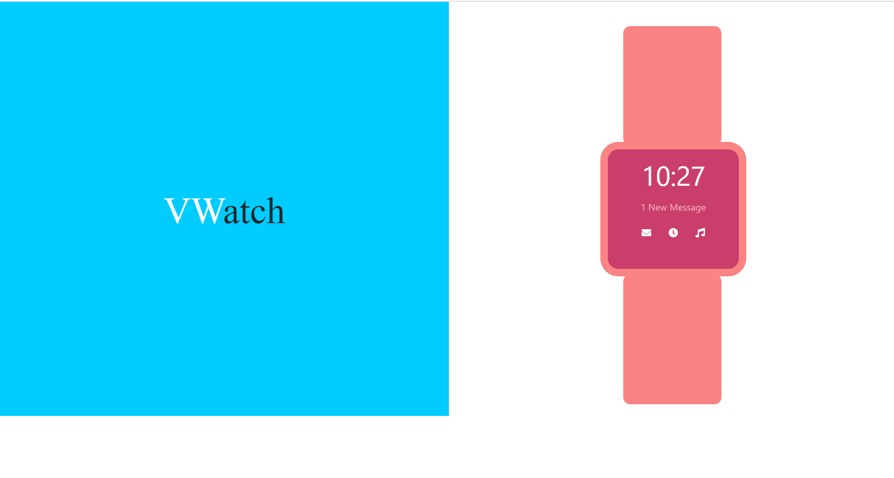
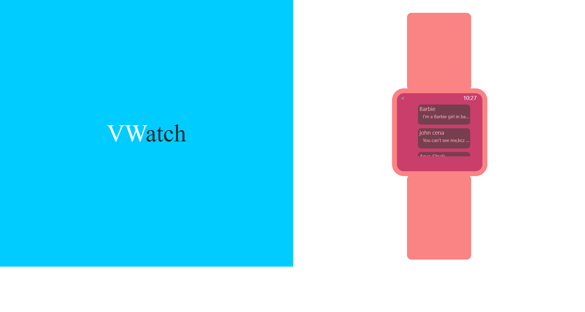
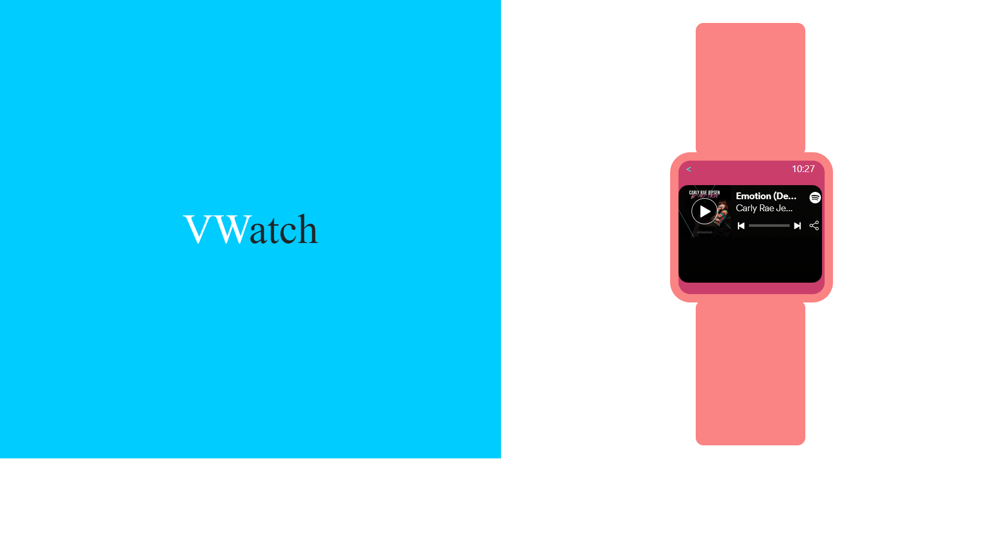

# VWatch
  Smartwatch is as like any other new-generation technie-watches, The watch is programmed to play music, preview messages and has timer clock for you. All you need to click it and get it 
  
 # Getting started
   The procedure is complex-free and the UI is user-friendly
 ## how to use
   
Step1: The first display is the homepage, it comprises of all the features like the time display, messages, music player and timer

Step 2: Click the messages icon, to preview the messages 

Step 3: Listen to music from Spotify, by just clicking the music icon in the home screen and listen to your favourites

# Author
 VARUN
